# 🛡️ CrowdShield - AI-Powered Crowd Management System

<div align="center">

<!-- Animated Banner -->


**🏆 #5 Winner in SUNHACKS 2K25 🏆**

<!-- Animated Badges -->
<p align="center">
  
  
  
  
  
</p>

<!-- Animated Stats -->


*A comprehensive crowd management and monitoring system with real-time AI person counting, live webcam streaming, and intelligent alert systems.*

[🚀 Quick Start](#-quick-start) • [📱 Features](#-features) • [🛠️ Tech Stack](#️-technology-stack) • [📁 Project Structure](#-project-structure) • [🔧 Setup](#-setup)

</div>

---

## 🌟 Features

<div align="center">

<!-- Animated Feature Table -->
| 🔴 **Live Monitoring** | 🗺️ **Smart Analytics** | 🚨 **Alert System** | 🔐 **Security** |
|:----------------------:|:----------------------:|:-------------------:|:---------------:|
|  |  |  |  |
| Real-time camera feeds | Interactive heatmaps | Email notifications | JWT authentication |
| AI person counting | Crowd density mapping | Audio alerts | OTP verification |
| Multi-zone tracking | Predictive analytics | Emergency protocols | Role-based access |

</div>

### 🎯 **Core Capabilities**

<!-- Animated Typing Effect for Features -->


---

## 🛠️ Technology Stack

<div align="center">

### **Frontend Layer** 🎨
```ascii
┌─────────────────────────────────────────────────────────────┐
│                    🎯 React + TypeScript                   │
├─────────────────────────────────────────────────────────────┤
│  🎨 Tailwind CSS  │  🧩 Shadcn/ui  │  🗺️ Mapbox GL JS   │
└─────────────────────────────────────────────────────────────┘
```

### **Backend Layer** ⚙️
```ascii
┌─────────────────────────────────────────────────────────────┐
│                   🚀 FastAPI + Python                     │
├─────────────────────────────────────────────────────────────┤
│  🗄️ Motor (MongoDB)  │  🔐 JWT + OTP  │  📧 SMTP Email   │
└─────────────────────────────────────────────────────────────┘
```

### **AI/ML Layer** 🤖
```ascii
┌─────────────────────────────────────────────────────────────┐
│                    🧠 YOLO + OpenCV                       │
├─────────────────────────────────────────────────────────────┤
│  👥 Person Detection  │  🔢 Counting  │  📊 Analytics    │
└─────────────────────────────────────────────────────────────┘
```

<!-- Animated Tech Stack Icons -->
<p align="center">
  
</p>

</div>

---

## 📁 Project Structure

<div align="center">

<!-- ASCII Art Project Structure -->
```ascii
┌─────────────────────────────────────────────────────────────────────────────────────────────────────────────┐
│                                    🏗️ CROWDSHIELD PROJECT ARCHITECTURE                                    │
└─────────────────────────────────────────────────────────────────────────────────────────────────────────────┘
```

</div>

<details>
<summary><b>🎯 Frontend Architecture - Click to Expand</b></summary>

```
📦 client/                          # 🚀 React Frontend Application
├── 📱 components/                   # 🧩 Reusable UI Components
│   ├── 🗺️ CrowdHeatmap.tsx         # 📊 Interactive Heatmap Component
│   ├── 🔐 ProtectedRoute.tsx       # 🛡️ Authentication Guard
│   └── 🎨 ui/                      # 🎭 Design System Components
│       ├── 📋 accordion.tsx        # 📝 Collapsible Content
│       ├── 🚨 alert-dialog.tsx     # ⚠️ Alert Modals
│       ├── 🔔 alert.tsx            # 📢 Notification System
│       └── ...                     # 🎨 48+ UI Components
├── 🎨 global.css                   # 🌈 Global Styles & Themes
├── 🪝 hooks/                       # 🔗 Custom React Hooks
│   ├── 📱 use-mobile.tsx           # 📱 Mobile Detection
│   └── 🔔 use-toast.ts             # 🍞 Toast Notifications
├── 🏠 pages/                       # 📄 Application Pages
│   ├── 🔐 Auth.tsx                 # 🔑 Authentication Pages
│   ├── 📊 Dashboard.tsx            # 🎛️ Main Dashboard
│   ├── 🏠 Index.tsx                # 🏠 Landing Page
│   └── ...                         # 📄 Additional Pages
├── 🗺️ types/                       # 📝 TypeScript Definitions
│   └── 🗺️ mapbox.d.ts              # 🗺️ Mapbox Type Definitions
└── 📦 package.json                 # 📋 Frontend Dependencies
```

</details>

<details>
<summary><b>⚙️ Backend Architecture - Click to Expand</b></summary>

```
📦 backend/                          # 🐍 Python Backend Services
├── 🎥 live_person_counter.py       # 👥 Real-time Person Counting
├── 🚀 main.py                      # 🚀 FastAPI Application
├── 🧠 object_class.names           # 🏷️ YOLO Class Labels
└── 📋 requirements.txt             # 🐍 Python Dependencies
```

</details>

<details>
<summary><b>🌐 Server & Deployment - Click to Expand</b></summary>

```
📦 server/                           # 🖥️ Node.js Server Services
├── 📧 emailService.ts              # 📧 Email Service Layer
├── 🚀 index.ts                     # 🚀 Express Server
├── 🔨 node-build.ts                # 🛠️ Build Configuration
└── 🛣️ routes/                      # 🛣️ API Route Definitions
    └── 🎮 demo.ts                  # 🎮 Demo API Routes

📦 deployment/                       # 🚀 Deployment Scripts
├── 🚀 deploy.py                    # 🐧 Linux/Mac Deployment
├── 🪟 deploy.bat                   # 🪟 Windows Deployment
├── 🌐 netlify.toml                 # 🌐 Netlify Configuration
└── 📁 netlify/functions/           # ⚡ Serverless Functions
    └── 🌐 api.ts                   # 🌐 Netlify API Functions
```

</details>

---

## 🚀 Quick Start

<div align="center">

### **🎯 Choose Your Deployment Method**

<!-- Animated Deployment Options -->


</div>

### **⚡ Option 1: Automated Deployment (Recommended)**

<details>
<summary><b>🪟 Windows Users - One-Click Setup</b></summary>

```batch
# 🎯 Double-click deploy.bat or run in PowerShell:
.\deploy.bat

# ✨ This automatically:
# 1. 🐍 Sets up Python virtual environment
# 2. 📦 Installs all dependencies
# 3. 🗄️ Starts MongoDB service
# 4. 🚀 Launches backend server
# 5. 🎨 Starts React frontend
# 6. 🌐 Opens browser to application
```

</details>

<details>
<summary><b>🐧 Linux/Mac Users - Automated Script</b></summary>

```bash
# 🚀 Run the automated deployment script:
python deploy.py

# 🎯 Features include:
# ✅ Dependency checking
# ✅ Virtual environment setup
# ✅ MongoDB initialization
# ✅ Service startup
# ✅ Health checks
# ✅ Browser launch
```

</details>

### **🔧 Option 2: Manual Deployment**

<details>
<summary><b>📋 Step-by-Step Manual Setup</b></summary>

#### **1. 🚀 Clone & Setup**
```bash
git clone <repository-url>
cd crowdshield
```

#### **2. 🐍 Python Backend Setup**
```bash
# Create virtual environment
python -m venv venv

# Activate virtual environment
# Windows:
venv\Scripts\activate
# Linux/Mac:
source venv/bin/activate

# Install Python dependencies
pip install -r backend/requirements.txt
```

#### **3. 📦 Node.js Frontend Setup**
```bash
# Install Node.js dependencies
cd client
npm install
cd ..
```

#### **4. 🗄️ Start MongoDB**
```bash
# Windows
net start MongoDB

# Linux/Mac
sudo systemctl start mongod
# or
brew services start mongodb-community
```

#### **5. ⚙️ Start Backend Services**
```bash
cd backend
uvicorn main:app --reload --host 0.0.0.0 --port 8000
```

#### **6. 🎨 Start Frontend**
```bash
# In a new terminal
cd client
npm run dev
```

#### **7. 🌐 Access Application**
- **🎨 Frontend**: http://localhost:5173
- **⚙️ Backend API**: http://localhost:8000
- **📚 API Docs**: http://localhost:8000/docs

</details>

---

## 📱 Live Webcam Setup

<div align="center">

### **📱 Mobile Camera Integration Workflow**

<!-- ASCII Workflow Diagram -->
```ascii
┌─────────────┐    ┌─────────────┐    ┌─────────────┐    ┌─────────────┐
│   📱 Phone  │───▶│  📡 WiFi    │───▶│  💻 Computer │───▶│  🧠 AI      │
│ IP Webcam   │    │ Network     │    │ CrowdShield │    │ Processing  │
│ App Running │    │ Connection  │    │ Dashboard   │    │ YOLO + CV   │
└─────────────┘    └─────────────┘    └─────────────┘    └─────────────┘
      ↓                    ↓                    ↓                    ↓
  📷 Stream        🌐 IP Address      🎥 Live Feed        👥 Count People
```

</div>

### **🔧 Configuration Steps**

<table align="center">
<tr>
<td width="50%">

**📱 Mobile Setup**
1. Install **IP Webcam** app
2. Configure video settings:
   - Resolution: `720p/480p`
   - Format: `MJPEG/H.264`
   - FPS: `15-30`
3. Start server & note IP
4. Test connection

</td>
<td width="50%">

**💻 Dashboard Setup**
1. Open `client/pages/Dashboard.tsx`
2. Update stream URL:
```typescript
liveStreamUrl: "http://YOUR_IP:8080/video"
```
3. Save and restart frontend
4. Click "Test Stream" button

</td>
</tr>
</table>

### **⚙️ Optimal Camera Settings**

<!-- Settings Table with Emojis -->
| Setting | Recommended Value | Description |
|---------|-------------------|-------------|
| 📐 Resolution | `1280x720` or `640x480` | Balance quality vs performance |
| 🎬 Frame Rate | `15-30 fps` | Smooth detection without lag |
| 🎥 Video Format | `MJPEG` | Best compatibility |
| 🔌 Port | `8080` | Default IP Webcam port |
| 📡 Network | `Same WiFi` | Ensure low latency |

---

## 🎯 Usage Guide

<div align="center">

### **🚀 User Journey Workflow**

```mermaid
graph LR
    A[🔐 Authentication] --> B[📊 Dashboard]
    B --> C[🎥 Live Stream]
    C --> D[👥 AI Detection]
    D --> E[📈 Analytics]
    E --> F[🚨 Alerts]
    F --> G[🗺️ Heatmaps]
    
    style A fill:#ff9999
    style B fill:#66b3ff
    style C fill:#99ff99
    style D fill:#ffcc99
    style E fill:#ff99cc
    style F fill:#ffff99
    style G fill:#cc99ff
```

<!-- Animated User Flow -->




</div>

### **📊 Dashboard Features**

<details>
<summary><b>🎥 Live Monitoring Panel</b></summary>

- **Real-time Video Feed**: Live camera stream with overlay
- **Person Detection**: YOLO-powered person counting with bounding boxes
- **Zone Tracking**: Multiple area monitoring capabilities
- **FPS Counter**: Performance monitoring display
- **Connection Status**: Stream health indicators

</details>

<details>
<summary><b>🚨 Alert Configuration</b></summary>

- **Threshold Settings**: Configure crowd density limits
- **Email Notifications**: Automated alert system
- **Audio Warnings**: Multi-language voice alerts
- **Emergency Protocols**: Escalation procedures
- **Custom Rules**: Personalized alert conditions

</details>

<details>
<summary><b>🗺️ Analytics & Heatmaps</b></summary>

- **Interactive Maps**: Mapbox-powered visualization
- **Crowd Density**: Real-time heat mapping
- **Historical Data**: Trend analysis and reports
- **Safe Routing**: Optimal path suggestions
- **Peak Time Analysis**: Usage pattern insights

</details>
